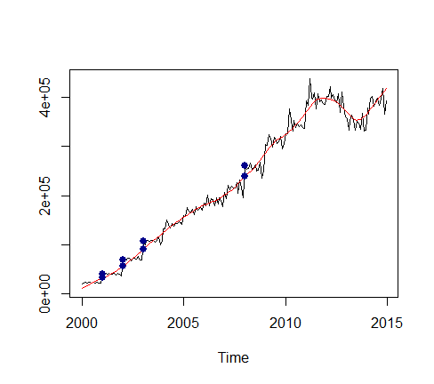

Castor
========

**C**haracterization and **A**nalysis of **S**tatistical **T**ime series comprised **O**f **R**eal world data (CASTOR) 


Castor and Pollux were twin brothers whose mother was Leda.  Pollux's father was Zeus, which made him a demigod.  However, Castor's father, Tyndareus, while the king of Sparta, was only a mortal and hence, so was Castor.  As a mere mortal, Castor had no god-like powers, as such, this time series package has no methods for forecasting the future.  All methods support exploratory analysis and characterization of time series comprised of real word data in an OMOP CDM.

## Getting Started

1. Make sure you have your data in the OMOP CDM v5.x format
    (https://github.com/OHDSI/CommonDataModel).

1. This is an R package and assumes you have R installed. 

1. In R, use the following commands to install Castor.

    ```r
    if (!require("devtools")) install.packages("devtools")
    
    # To install the master branch
    devtools::install_github("OHDSI/Castor")
    
    ```

## Examples

**Create a monthly prevalence time series object from Achilles and retrieve the individual time series for a single concept id**

    ```r
	# concept_id: 4008576
	# concept name: Diabetes mellitus without complication (disorder)
	# SNOMED concept code: 111552007
	#
	cd <- DatabaseConnector::createConnectionDetails(dbms = "your dbms", server = "your server", port = the port)
	cdmSchema     <- "cdm"
	resultsSchema <- "ohdsi_results"
	conceptId     <- 4008576

	diabetesTs <- Castor::getAchillesTs(cd,cdmSchema,resultsSchema,conceptId)
	diabetesTs.prev <- diabetesTs[,"PREVALENCE"]
	diabetesTs.cv   <- diabetesTs[,"COUNT_VALUE"]
	diabetesTs.pwy  <- diabetesTs[,"PROPORTION_WITHIN_YEAR"]
    ```	
**Repeat the above example, using multiple concept ids**

    ```r
	# concept_ids: 4193704, 201826, 1503297
	# concept names: Type 2 diabetes mellitus without complication, Type 2 diabetes mellitus, metformin
	# SNOMED concept codes: 313436004, 44054006
	# RxNORM code: 6809

	cd <- DatabaseConnector::createConnectionDetails(dbms = "your dbms", server = "your server", port = the port)
	cdmSchema     <- "cdm"
	resultsSchema <- "ohdsi_results"
	conceptId     <- c(4193704, 201826, 1503297)

	diabetesTs <- Castor::getAchillesTs(cd,cdmSchema,resultsSchema,conceptId)
	diabetesTs.prev <- diabetesTs[,"PREVALENCE"]
	diabetesTs.cv   <- diabetesTs[,"COUNT_VALUE"]
	diabetesTs.pwy  <- diabetesTs[,"PROPORTION_WITHIN_YEAR"]
    ```	

**Create a monthly prevalence time series from Achilles and plot the results**

    ```r
	# concept_id: 4008576
	# concept name: Diabetes mellitus without complication (disorder)
	# SNOMED concept code: 111552007
	#
	cd <- DatabaseConnector::createConnectionDetails(dbms = "your dbms", server = "your server", port = the port)
	cdmSchema     <- "cdm"
	resultsSchema <- "ohdsi_results"
	conceptId     <- 4008576

	diabetesTs <- Castor::getAchillesTs(cd,cdmSchema,resultsSchema,conceptId)
	diabetesTs.prev <- diabetesTs[,"PREVALENCE"]
	ts.plot(diabetesTs.prev)
    ```	


**Subset the time series and plot different moving averages as well**

    ```r
	# We see a large dropoff in 2015, perhaps this is the ICD9 to 10 change?
	# Lets subset the time series to the year 2014 and observe how adding more terms to a 
	# moving averages smooths the curve
	diab2014 <- window(diabetesTs.prev, end=c(2014,12))

	ts.plot(
		diab2014,
		Castor::getMA(diab2014,3),
		Castor::getMA(diab2014,12),
		Castor::getMA(diab2014,30),
		Castor::getMA(diab2014),
		col=c("black","blue","green","orange","red"))
	```


**Examine the slope of the time series**

    ```r
	Castor::getSlopeAngleSize(diab2014)
	[1] 19.52814

	# If the angle seems like it should be 45 degrees,
	# keep in mind R performs a "close up" on the graph.
	# Zoom out a bit to see what's really going on
	ts.plot(
		diab2014,
		Castor::getMA(diab2014,3),
		Castor::getMA(diab2014,12),
		Castor::getMA(diab2014,30),
		Castor::getMA(diab2014),
		col=c("black","blue","green","orange","red"),
		xlim=c(2000,2020), ylim=c(0,20))
	```

	
**Plot time series with trend determined by stl**

    ```r
	# PLOT TS AND TREND
	diab2014.tr <- Castor::getTrend(diab2014)
	ts.plot(
		diab2014,
		diab2014.tr,
		col=c("black","red"))
	```


**Find outliers using stl plot them on both the trend and time series**

    ```r
	# Find stl outliers and highlight them on both the trend and original time series in purple
	to <- Castor::getOutliers(diab2014,"stl")
	ts.plot(diab2014,diab2014.tr,col=c("black","red"))
	points(x=time(diab2014.tr)[to],y=diab2014.tr[to],col="purple",cex=1.1,pch=16)
	points(x=time(diab2014)[to],y=diab2014[to],col="purple",cex=1.1,pch=16)
	```


**Find transition points of the trend - these are points where trend changes direction (from decreasing to increasing and vice versa)**

    ```r
	# Find transition points and highlight them on both the trend and original time series in blue
	tp <- Castor::getTrendTransitionPoints(diab2014)
	# Comment out the line below to re-use the plot from the previous example and see the transition points
	# and outliers in the same graph.
	ts.plot(diab2014,diab2014.tr,col=c("black","red"))
	points(x=time(diab2014.tr)[tp],y=diab2014.tr[tp],col="darkblue",cex=1.1,pch=16)
	points(x=time(diab2014)[tp],y=diab2014[tp],col="darkblue",cex=1.1,pch=16)
	```


**Find change points 1**

    ```r	
	# Find change points - defined (in this example) as transition points that continue in the new direction for 12 months
	# and identify them on the trend and the original time series in green.
	# NB: The points are plotted on the trend and time series from the previous example.
	cp <- Castor::getTrendChangePoints(diab2014,nPeriods = 12)
	points(x=time(diab2014.tr)[cp],y=diab2014.tr[cp],col="green",cex=1.1,pch=16)
	points(x=time(diab2014)[cp],y=diab2014[cp],col="green",cex=1.1,pch=16)
	```

	
**Find change points 2**

    ```r	
	# Find change points - defined (in this example) as transition points that have changed by more .1%
	# and continue in the new direction for 6 months.
	# Identify them on the trend and the original time series in orange.
	# NB: The points are plotted on the trend and time series from the previous example.
	cp <- Castor::getTrendChangePoints(diab2014,minPctChange = .001)
	points(x=time(diab2014.tr)[cp],y=diab2014.tr[cp],col="darkorange",cex=1.1,pch=16)
	points(x=time(diab2014)[cp],y=diab2014[cp],col="darkorange",cex=1.1,pch=16)
	```


**Search the neighborhood to find points of interest**

    ```r	
	# Suppose you want to investigate whether or not there has been a 25% increase or decrease
	# in the number of cases in any month.  Search the neighbohood of the count time series
	# and highlight the points of interest on both the time series and the trend.

	diab2014.cv <- window(diabetesTs[,"COUNT_VALUE"],end=c(2014,12))
	nHood <- Castor::getNeighborhoodDf(diab2014.cv)
	poi <- which(nHood$PCT_CHANGE > .25)
	diab2014.cv.tr <- Castor::getTrend(diab2014.cv)
	ts.plot(
		diab2014.cv,
		diab2014.cv.tr,
		col=c("black","red"))
	points(x=time(diab2014.cv.tr)[poi],y=diab2014.cv.tr[poi],col="darkblue",cex=1.1,pch=16)
	points(x=time(diab2014.cv)[poi],y=diab2014.cv[poi],col="darkblue",cex=1.1,pch=16)
	```


**Perform basic interval characterization**

    ```r	
	# Characterize the behavior of the time series over intervals of interest.
	# For this example, if we ignore monthly changes that are less than 20% than the previous month, 
	# how would the time series be characterized in 2005? What about at 5%?
	diab2014.cv.df <- Castor::tsToDf(diab2014.cv)
	diab2014.cv.df[diab2014.cv.df$YEAR == 2005,]
	startPos2005 <- 61
	endPos2005   <- 72

	Castor::getIntervalCharacterization(diab2014.cv,startPos2005,endPos2005,.2)
	[1] "CONSTANT"
	Castor::getIntervalCharacterization(diab2014.cv,startPos2005,endPos2005,.05)
	[1] "INCREASING"

	# We see the characterization of the time series is impacted depending on what we consider a change
	```
	
**Custom (non-Achilles) time series 1**

	```r
	# How many distinct people were diagnosed with a condition (any condition)
	# every year from 2008 to 2018?  Build a yearly time series of distinct counts from 
	# condition_occurrence.
	tableName      <- "condition_occurrence"
	dateColumnName <- "condition_start_date"
	startDate      <- "2008-01-01"
	endDate        <- "2018-12-31"
	dataColumnName <- "person_id"

	tsData <- Castor::getCountTs(cd,cdmSchema,tableName,dateColumnName,startDate,endDate,dataColumnName,TRUE,"year")
	ts.plot(tsData)
	```

	
**Custom (non-Achilles) time series 2**

	```r
	# How many daily refills were there for all drugs per day in 2017?
	tableName       <- "drug_exposure"
	dateColumnName  <- "drug_exposure_start_date"
	startDate       <- "2017-01-01"
	endDate         <- "2017-12-31"
	dataColumnName  <- "refills"

	tsData <- Castor::getRawTs(cd,cdmSchema,tableName,dateColumnName,startDate,endDate,dataColumnName,"day")
	ts.plot(tsData, Castor::getMA(tsData,15), col=c("black","red"))
	```

